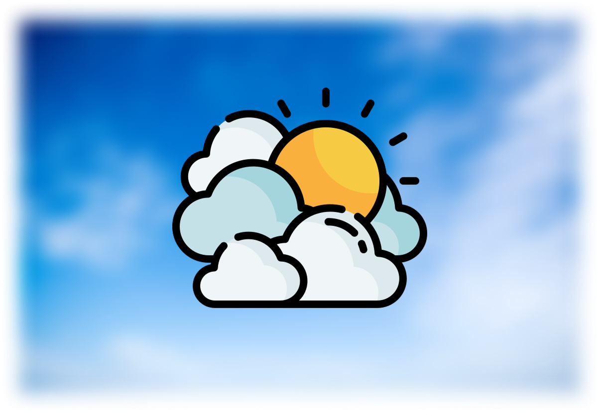

# WeatherApp

  

## Общее описание
Android‑приложение погоды, получает данные из OpenWeather, поддерживает русскую и английскую локализацию, поиск и выбор локации на карте. Имеет виджет рабочего стола с многодневным прогнозом.

## Основные возможности
- Текущая погода и 4‑дневный прогноз с динамическими иконками и фоном.
- Поиск города с подсказками (ru/en), локализация UI и тултипов.
- Выбор точки на карте и загрузка прогноза по координатам.
- Виджет рабочего стола с городом и многодневным прогнозом.
- Уведомления о погоде, кеширование последних данных для корректной работы виджета.

## Зависимости
- AndroidX AppCompat / ConstraintLayout / Material.
- Google Play Services: Location, Maps.
- OpenWeather API (`OPEN_WEATHER_API_KEY`).
- Google Maps API (`GOOGLE_MAPS_API_KEY`).
- Gradle/AGP; Java 17.

## Архитектура
- Основное activity: `MainActivity` — UI, поиск, выбор города/координат.
- Загрузка погоды — `Weather` (`AsyncTask`) с запросами к OpenWeather.
- Обновление виджета — `WeatherWidgetProvider`, хранение данных — `LastWeatherStorage`.
- Выбор локации на карте — `MapPickerActivity` (Google Maps SDK).

## Структура
- `app/src/main/java/com/kegszool/weather/` — основной код (activity, виджет, хранилище, загрузчик погоды).
- `app/src/main/res/layout/` — макеты экрана, карты и виджета.
- `app/src/main/res/values*/` — строки, цвета и локализованные ресурсы.
- `app/src/main/res/xml/` — конфигурация виджета.
- `app/build.gradle` — зависимости и подключение ключей из `.env` (`OPEN_WEATHER_API_KEY`, `GOOGLE_MAPS_API_KEY`).

## Превью
<video src="asset/preview.mp4" width="640" height="360" controls></video>
